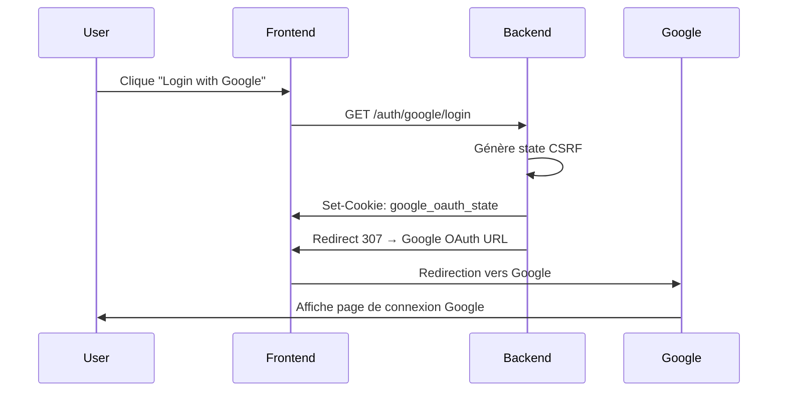
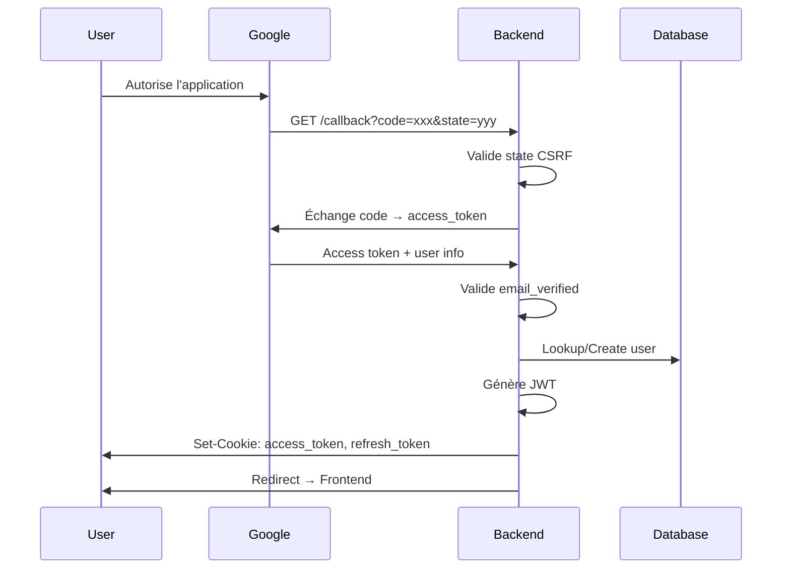

# Google OAuth Flow Documentation

## 📋 Vue d'ensemble

Cette documentation détaille l'architecture technique et le flow complet d'authentification Google OAuth implémenté dans WowPerf.

## 🏗️ Architecture

### Structure du Code

```
internal/
├── api/auth/google/
│   ├── handler.go          # Endpoints OAuth (/login, /callback)
│   └── errors.go           # Gestion centralisée des erreurs
├── services/auth/google/
│   ├── service.go          # Logique métier OAuth
│   ├── repository.go       # Accès données + création users
│   ├── types.go            # Structures Google OAuth
│   └── config.go           # Configuration et validation
└── models/
    └── user.go            # Modèle User avec champs Google
```

### Services et Responsabilités

| Service                  | Responsabilité                                |
| ------------------------ | --------------------------------------------- |
| **GoogleAuthHandler**    | Orchestration des endpoints OAuth             |
| **GoogleAuthService**    | Logique métier (échange tokens, validation)   |
| **GoogleAuthRepository** | Persistance (création users, username unique) |
| **AuthService**          | Génération JWT et cookies (réutilisé)         |

## 🔄 Flow d'Authentification Complet

### 1. Initiation (`/auth/google/login`)



**Code Handler :**

```go
func (h *GoogleAuthHandler) InitiateGoogleAuth(c *gin.Context) {
    // 1. Générer URL + state CSRF
    authURL, state, err := h.service.GetAuthURL()

    // 2. Cookie sécurisé (10 min)
    c.SetCookie("google_oauth_state", state, 600, "/", "", true, true)

    // 3. Redirection vers Google
    c.Redirect(http.StatusTemporaryRedirect, authURL)
}
```

### 2. Callback Google (`/auth/google/callback`)



**Code Handler (simplifié) :**

```go
func (h *GoogleAuthHandler) HandleGoogleCallback(c *gin.Context) {
    // 1. Validation paramètres + CSRF
    code, state := c.Query("code"), c.Query("state")
    h.validateState(c, state)

    // 2. Échange code → token
    token := h.service.ExchangeCodeForToken(ctx, code)

    // 3. Récupération infos utilisateur
    userInfo := h.service.GetUserInfoWithRetry(ctx, token)

    // 4. Logique login/signup/linking
    authResult := h.service.ProcessUserAuthentication(userInfo)

    // 5. JWT + cookies
    h.setAuthenticationCookies(c, authResult.User)

    // 6. Redirection finale
    h.redirectToFrontendWithSuccess(c, authResult)
}
```

## 🔍 Logique Métier Complexe

### Lookup Utilisateur (Recommandations Google)

La logique suit les **4 cas recommandés par Google** :

```go
func (s *GoogleAuthService) LookupUser(googleID, email string) (*UserLookupResult, error) {
    // CAS 1: Recherche par Google ID (PRIORITAIRE)
    if user := FindUserByGoogleID(googleID); user != nil {
        return &UserLookupResult{ExistingUser: user, FoundByGoogleID: true}
    }

    // CAS 2: Recherche par email vérifié
    if user := FindUserByEmail(email); user != nil {
        canAutoLink := !user.IsGoogleLinked() // Pas déjà lié à Google
        return &UserLookupResult{
            ExistingUser: user,
            FoundByEmail: true,
            CanAutoLink: canAutoLink,
        }
    }

    // CAS 3: Aucun utilisateur trouvé → nouveau signup
    return &UserLookupResult{}, nil
}
```

### Traitement selon le Cas

| Cas                              | Action               | Résultat           |
| -------------------------------- | -------------------- | ------------------ |
| **Google ID trouvé**             | Login immédiat       | `method: "login"`  |
| **Email trouvé + pas de Google** | Liaison automatique  | `method: "link"`   |
| **Email trouvé + déjà Google**   | Erreur (conflit)     | Erreur explicite   |
| **Aucun match**                  | Création utilisateur | `method: "signup"` |

## 🆔 Génération Username Intelligente

### Stratégie Progressive

```go
func (r *GoogleAuthRepository) CreateUserFromGoogle(userInfo *GoogleUserInfo) (*models.User, error) {
    baseUsername := generateBaseUsername(userInfo) // Ex: "ludovic"

    // 1. Essayer le base
    if user := tryCreateUser(baseUsername, userInfo); success {
        return user // ✅ "ludovic"
    }

    // 2. Trouver prochain numéro disponible
    nextNumber := findNextAvailableNumber(baseUsername) // Ex: 3

    // 3. Essayer 100 variations
    for i := nextNumber; i < nextNumber+100; i++ {
        username := fmt.Sprintf("%s%d", baseUsername, i) // "ludovic3"
        if user := tryCreateUser(username, userInfo); success {
            return user // ✅ "ludovic3"
        }
    }

    // 4. Fallback UUID (cas extrême)
    uuid := generateUUID8()
    username := fmt.Sprintf("%s_%s", baseUsername, uuid) // "ludovic_a1b2c3d4"
    return tryCreateUser(username, userInfo)
}
```

### Algorithme findNextAvailableNumber

```sql
-- Trouve le plus grand numéro existant pour un username base
SELECT COALESCE(MAX(
    CASE
        WHEN username ~ '^ludovic[0-9]+$'
        THEN CAST(REGEXP_REPLACE(username, '^ludovic', '', 'g') AS INTEGER)
        ELSE 0
    END
), 0) as max_num
FROM users
WHERE username = 'ludovic' OR username ~ '^ludovic[0-9]+$'
```

**Exemples :**

- Base: `ludovic`, Existants: `ludovic`, `ludovic1`, `ludovic2` → Prochain: `ludovic3`
- Base: `marie`, Existants: `marie5`, `marie8` → Prochain: `marie9`

## 🔐 Sécurité et Validation

### Protection CSRF

```go
// Génération state (32 bytes aléatoires)
state := base64.URLEncoding.EncodeToString(randomBytes)

// Cookie sécurisé (10 minutes)
c.SetCookie("google_oauth_state", state, 600, "/", "", true, true)

// Validation au callback
if receivedState != storedState {
    return fmt.Errorf("CSRF state mismatch")
}
```

### Validation Google Stricte

```go
func validateGoogleUserInfo(userInfo *GoogleUserInfo) error {
    // 1. Email vérifié OBLIGATOIRE (recommandation Google)
    if !userInfo.VerifiedEmail {
        return &OAuthError{Code: "email_not_verified"}
    }

    // 2. Champs obligatoires
    if userInfo.Email == "" || userInfo.ID == "" {
        return &OAuthError{Code: "missing_required_fields"}
    }

    return nil
}
```

### Retry avec Backoff

```go
func GetUserInfoWithRetry(ctx context.Context, token *oauth2.Token) (*GoogleUserInfo, error) {
    for i := 0; i < 3; i++ { // 3 tentatives max
        userInfo, err := GetUserInfo(ctx, token)
        if err == nil {
            return userInfo, nil
        }

        // Backoff exponentiel : 1s, 2s, 4s
        time.Sleep(time.Duration(1<<uint(i)) * time.Second)
    }

    return nil, &OAuthError{Code: "user_info_retry_failed"}
}
```

## 📡 Endpoints API

### GET `/auth/google/login`

**Description :** Initie le flow OAuth Google

**Réponse :**

```http
HTTP/1.1 307 Temporary Redirect
Location: https://accounts.google.com/o/oauth2/auth?client_id=...
Set-Cookie: google_oauth_state=xyz; HttpOnly; Secure; Max-Age=600
```

### GET `/auth/google/callback`

**Description :** Traite le retour de Google

**Paramètres :**

- `code` : Code d'autorisation Google
- `state` : État CSRF pour validation
- `error` (optionnel) : Erreur si refus utilisateur

**Réponses :**

**Succès :**

```http
HTTP/1.1 303 See Other
Location: https://frontend.com/dashboard
Set-Cookie: access_token=jwt...; HttpOnly; Secure; Max-Age=604800
Set-Cookie: refresh_token=xxx; HttpOnly; Secure; Max-Age=2592000
```

**Erreur :**

```http
HTTP/1.1 303 See Other
Location: https://frontend.com/login?error=auth_failed&message=Invalid+credentials
```

## 🔧 Intégration avec AuthService Existant

Le système Google OAuth **réutilise** l'AuthService existant :

```go
// Génération JWT via service existant
accessToken := h.authService.GenerateToken(user.ID, expiration)
refreshToken := h.authService.GenerateRefreshToken(user.ID)

// Cookies via service existant
h.authService.SetAuthCookies(c, accessToken, refreshToken)
```

**Avantages :**

- ✅ Même format JWT pour tous les types d'auth
- ✅ Même gestion cookies/expiration
- ✅ Compatibilité totale avec middleware existant
- ✅ Pas de duplication de code

## 📊 Monitoring et Logs

### Logs Structurés

```go
// Logs de flow
log.Printf("🚀 Initiating Google OAuth flow")
log.Printf("🔐 Generated Google auth URL with state length: %d", len(state))
log.Printf("🍪 Google OAuth state cookie set with 10min expiration")

// Logs de résultat
log.Printf("Authentication successful: method=%s, new_user=%t, user_id=%d",
    result.Method, result.IsNewUser, result.User.ID)
log.Printf("Redirecting to frontend: %s (method: %s)", finalURL, result.Method)
```

### Métriques Importantes

- **Taux de conversion OAuth** : Initiation vs Completion
- **Méthodes d'auth** : login vs signup vs link
- **Erreurs fréquentes** : access_denied, email_not_verified
- **Performance** : Temps de création utilisateur
- **Username conflicts** : Fréquence des collisions

---

✅ **Architecture robuste, sécurisée et évolutive pour l'authentification Google OAuth !**
