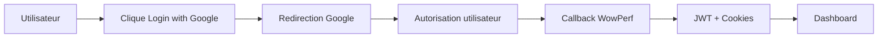

# WowPerf - World of Warcraft Performance Tracker

## 🚀 Authentication

WowPerf supporte plusieurs méthodes d'authentification pour une expérience utilisateur optimale.

### Méthodes Supportées

- 🔐 **Email/Password** - Authentification traditionnelle
- ⚔️ **Battle.net OAuth** - Connexion avec compte Blizzard
- 🌐 **Google OAuth** - Connexion avec compte Google _(Nouveau !)_

### Google OAuth Integration

L'authentification Google permet aux utilisateurs de se connecter rapidement et sécurisément avec leur compte Google.

#### ✨ Fonctionnalités

- **Login/Signup automatique** - Création de compte transparente
- **Liaison de comptes** - Associer Google à un compte existant
- **Username intelligent** - Génération automatique d'usernames uniques
- **Sécurité renforcée** - Protection CSRF, validation email, cookies sécurisés

#### 🔗 Endpoints

```
GET  /api/auth/google/login     # Initiation du flow OAuth
GET  /api/auth/google/callback  # Callback de traitement Google
```

#### 📊 Flow Utilisateur



#### 🛡️ Sécurité

- **Protection CSRF** via state parameter
- **Email vérifié** obligatoire par Google
- **Cookies sécurisés** (HttpOnly, Secure, SameSite)
- **Timeouts** et retry automatique
- **Contraintes uniques** en base de données

## 📚 Documentation Détaillée

### Google OAuth

- **[Setup Guide](docs/OAuth/Google/setup.md)** - Configuration Google Cloud Console
- **[Technical Flow](docs/OAuth/Google/flow.md)** - Architecture et flow technique détaillé
- **[Security Guide](docs/OAuth/Google/security.md)** - Mesures de sécurité et bonnes pratiques
- **[Deployment Guide](docs/OAuth/Google/deployment.md)** - Déploiement production et monitoring

### Configuration Rapide

1. **Variables d'environnement** :

   ```env
   GOOGLE_CLIENT_ID=your-client-id.googleusercontent.com
   GOOGLE_CLIENT_SECRET=your-client-secret
   GOOGLE_REDIRECT_URL=https://your-domain.com/api/auth/google/callback
   FRONTEND_URL=https://your-domain.com
   ```

2. **Frontend Integration** :

   ```html
   <a href="/api/auth/google/login"> Login with Google </a>
   ```

3. **Test** :
   ```bash
   curl https://your-api.com/auth/google/login
   # Should redirect to Google OAuth
   ```

## 🏗️ Architecture

### Services d'Authentification

```
internal/
├── api/auth/google/          # Handlers OAuth Google
├── services/auth/google/     # Logique métier Google OAuth
├── services/auth/            # AuthService principal (JWT, cookies)
└── models/                   # Modèles User avec champs OAuth
```

### Base de Données

```sql
-- Champs Google OAuth dans table users
ALTER TABLE users ADD COLUMN google_id VARCHAR(255) UNIQUE;
ALTER TABLE users ADD COLUMN google_email VARCHAR(255);
```

## 🚀 Démarrage Rapide

### Development

```bash
# 1. Configuration Google OAuth (voir setup.md)
# 2. Variables d'environnement
cp .env.example .env
# Éditer .env avec vos credentials Google

# 3. Démarrage
go run cmd/server/main.go

# 4. Test
open https://localhost/api/auth/google/login
```

### Production

```bash
# Déploiement avec Docker Compose
docker-compose up -d

# Vérification
curl -f https://api.wowperf.com/health
```

## 📊 Monitoring

### Métriques OAuth

- **Conversion Rate** : Initiations → Completions
- **Success Rate** : Success / Total attempts
- **User Acquisition** : New signups via Google
- **Error Tracking** : CSRF, validation, API failures

### Dashboards

- **Grafana** : Métriques temps réel OAuth
- **Sentry** : Error tracking et alertes
- **Logs** : Structured logging avec trace IDs

## 🛠️ Contribution

### Développement OAuth

1. **Setup local** : Suivre [setup.md](docs/OAuth/Google/setup.md)
2. **Tests** : `go test ./internal/services/auth/google/...`
3. **Sécurité** : Respecter [security.md](docs/OAuth/Google/security.md)

### Guidelines

- Tous les endpoints OAuth doivent être loggés
- Protection CSRF obligatoire
- Tests de régression pour les flows critiques
- Documentation à jour pour tout changement

---

Pour plus d'informations, consultez la [documentation complète](docs/OAuth/Google/) ou contactez l'équipe de développement.
